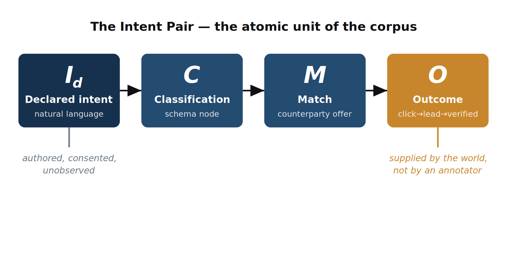

<h1 align="center">42-True</h1>

<div align="center">
  
</div>

<div align="center">

**A Large Meaning Model for declared human intent**

*Resolving what people want, in conditions where nothing is watching.*

[](https://github.com/shawnjensen/42-True/actions/workflows/ci.yaml)
[](LICENSE)
[](pyproject.toml)
[](#status--roadmap)
[](paper/42-True_LMM_paper.pdf)
[](https://doi.org/10.5281/zenodo.20616391)

</div>

---

> **This repository is the first public concept of the model**, not a trained
> system. It publishes the **schema** and a set of conceptual **recipes** for the
> proposed corpus. The intent is twofold: first, to seed a body of
> **declared-intent training data** that post-training stacks like
> [Tinker](https://github.com/thinking-machines-lab/tinker-cookbook) can learn
> from; and second — as that corpus grows — to become a **Large Meaning Model in
> its own right**. The corpus described here does not yet exist and cannot be
> scraped: it must be *produced*. See [Why this doesn't train yet](#why-this-doesnt-train-yet).

## Background

Contemporary AI is trained, with rare exception, on **observational** data —
text and behaviour recorded under conditions where the subject was, or assumed
they were, watched. Nine decades of behavioural science establish that
observation distorts behaviour; a corpus assembled under observation therefore
carries a distortion that scale only reinforces.

42-True proposes a structurally different class of training data: **declared
intent paired with a verified outcome**, gathered in an environment that is
architecturally incapable of identifying the declarant. We call its atomic unit
the **intent pair**, and the model trained upon it the **Large Meaning Model
(LMM)**. The full argument is in the paper — included here as a
[local copy](paper/42-True_LMM_paper.pdf) and published of record on Zenodo at
[doi:10.5281/zenodo.20616391](https://doi.org/10.5281/zenodo.20616391).

## The intent pair

The atomic unit of the corpus is the four-tuple:

```text
IntentPair = ( Id, C, M, O )
```

- **`Id` — Declared intent.** A want, stated in natural language, authored and
  consented, bound only to an unlinkable token.
- **`C` — Classification.** The declaration mapped to a machine-addressable
  taxonomy node by a three-tier resolver (agents, community, experts).
- **`M` — Match.** The counterparty offer returned in response. Counterparties
  see only the classification, never the raw signal.
- **`O` — Outcome.** The realised consequence — graded from no-engagement
  through to a cryptographically verified resolution. **Supplied by the
  declarant's own subsequent action in the world, not by an annotator.**

```python
from forty_two_true import (
    IntentPair, DeclaredIntent, Classification, Match, Outcome,
    ClassificationTier, OutcomeGrade,
)

pair = IntentPair(
    declared_intent=DeclaredIntent(
        text="a weekend that makes me feel twenty again",
        authored_at="2026-06-01T09:00:00Z",
        unlinkable_token="zk:7f3a1c9e",
    ),
    classification=Classification(
        taxonomy_code="travel.restorative",
        label="Restorative travel",
        tier=ClassificationTier.AGENT,
        confidence=0.91,
    ),
    match=Match(counterparty_kind="service", offer="A spa-and-hiking weekend in the Alps"),
    outcome=Outcome(grade=OutcomeGrade.CONVERSION, verified=True, proof_ref="att:e91c44"),
)

assert pair.outcome.grade >= OutcomeGrade.CLICK
```

Unlike a static NLU label (assigned by an annotator) or an RLHF preference
(whose consequence is synthetic), the outcome `O` is **lived**. All models are
**frozen**: an intent pair records what happened; corrections produce new
records, and the corpus grows by accumulation.

## Recipes

The lifecycle that produces an intent pair has four stages, mirrored in
[`forty_two_true/recipes/`](forty_two_true/recipes/):

| Stage | Module | Paper |
|---|---|---|
| **Declare** (`Id`) | [`declare.py`](forty_two_true/recipes/declare.py) | §VI privacy architecture |
| **Classify** (`C`) | [`classify.py`](forty_two_true/recipes/classify.py) | §V three-tier classification |
| **Match** (`M`) | [`match.py`](forty_two_true/recipes/match.py) | §VI zero-knowledge boundary |
| **Verify** (`O`) | [`verify.py`](forty_two_true/recipes/verify.py) | §III the intent pair |

Each completed cycle is stored and retrains both the classifier and the model —
the compounding loop (paper §IV.C). See the
[recipes README](forty_two_true/recipes/README.md) for details, and
[`data/example_intent_pairs.jsonl`](data/example_intent_pairs.jsonl) for
synthetic, clearly-labelled illustrations.

## Installation

```bash
# from a clone of this repository
pip install -e .

# with dev tooling (pytest, ruff)
pip install -e ".[dev]"
```

```bash
pytest
```

## Why this doesn't train yet

A purely theoretical treatment of the Large Meaning Model would be shorter than
this — and insufficient. The corpus does not exist. It **cannot be scraped** from
the public web (which is observational by construction), **cannot be simulated**
(the signal of interest is precisely what people declare when unobserved), and
**cannot be extracted** from existing systems (whose data is the data this model
is defined against).

The corpus must be **produced**, and production requires a network: a place where
declaration is safe, a layer that classifies declarations at scale, a market that
creates the conditions for outcomes to occur, and a verification layer that
anchors those outcomes to attestable events (paper §VIII). This repository is the
schema and the seed; the network is the work.

## Status & roadmap

| Phase | State |
|---|---|
| **0 — Concept** (this repo): schema, recipes, paper | ✅ public |
| **1 — Produced corpus**: declaration vault, classification tiers, attestation | proposed |
| **2 — Training data**: declared-intent pairs consumable by external LLM stacks (e.g. Tinker) | proposed |
| **3 — Standalone LMM**: a model that *resolves* declared intent against the accumulated corpus | proposed |

## Stewardship

A model trained on the declared intent of a population should not be the property
of any single commercial actor. The paper proposes that a **foundation** hold the
Large Meaning Model as a **commons**, steward the protocol, and distribute returns
to contributors in proportion to the value their contribution adds (paper §VII).
This repository is released in that spirit.

## Contributing

This project is offered in the spirit of open science. Feedback, critique of the
schema, and discussion of the production network are all welcome — see
[CONTRIBUTING.md](CONTRIBUTING.md).

## Citation

```bibtex
@misc{jensen2026fortytwotrue,
  author    = {Jensen, Shawn},
  title     = {42-True: A Large Meaning Model for Declared Human Intent},
  year      = {2026},
  publisher = {Zenodo},
  note      = {Profila GmbH},
  doi       = {10.5281/zenodo.20616391},
  url       = {https://doi.org/10.5281/zenodo.20616391},
}
```

The canonical, citable version of record is archived on Zenodo:
[doi:10.5281/zenodo.20616391](https://doi.org/10.5281/zenodo.20616391). The PDF in
[`paper/`](paper/) is a convenience copy of that deposit.

## License

[Apache-2.0](LICENSE) © 2026 Shawn Jensen / Profila GmbH.
